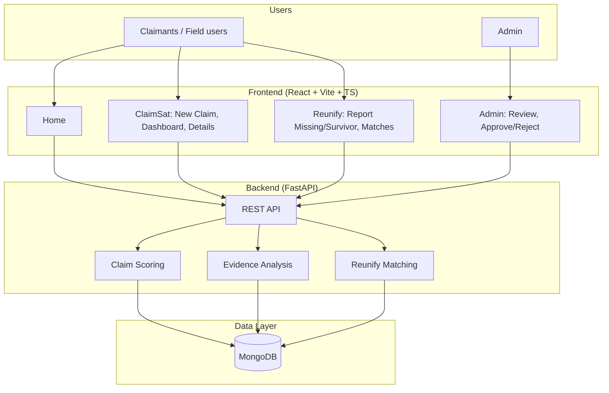

# ClaimSat + Reunify — PPT Content

**Disaster Response Platform: Damage Verification & Family Reunification**

Use the sections below as slide titles and bullet points. The System Architecture section includes a Mermaid diagram you can paste into tools like Mermaid Live or draw in PowerPoint.

---

## 1. Technology Tasks

### Frontend
- **Stack:** React 19, TypeScript, Vite 7, Tailwind CSS v4, React Router v7
- **UI/UX:** Responsive SPA with Tailwind; Leaflet/react-leaflet for maps (claim location, disaster zones)
- **Modules:** ClaimSat (new claim, dashboard, claim details), Reunify (report missing, report survivor, matches, match details), Admin (review claims, approve/reject)
- **State & data:** Local storage for claims/evidence/matches; API config for backend (env-based base URL)
- **Quality:** TypeScript strict mode, type-only imports (verbatimModuleSyntax), ESLint

### Backend
- **Stack:** Python, FastAPI, Uvicorn, Motor (async MongoDB), Pydantic
- **APIs:** REST — `/api/claims` (CRUD, evidence upload, scoring), `/api/reunify` (missing persons, survivors, matches)
- **Security:** CORS config, optional JWT (python-jose), bcrypt (passlib) for auth
- **Processing:** Claim scoring service, evidence analysis (OpenCV/Pillow/Shapely), reunify matching (Levenshtein, geopy)
- **Config:** Pydantic Settings, `.env`, configurable weights and thresholds

### Data Integrity
- **Single source:** Claims, evidence, and reunify data stored in MongoDB with consistent schemas (Pydantic models)
- **Indexes:** Unique IDs (claim_id, person_id, match_id), status, timestamps, 2dsphere for geo queries
- **Validation:** Request/response validation via Pydantic; file type/size limits for uploads
- **Audit:** Claim events (created, evidence_added, scored, status_changed) for traceability
- **Explainability:** Every score has a breakdown (location, time, evidence, visual, metadata) and text explanation

---

## 2. Impacts and Benefits

- **Faster verification:** Automated multi-factor scoring reduces manual assessment time and gives instant feedback (pending / needs review / approved / rejected).
- **Transparency:** Explainable confidence scores and breakdowns build trust and support appeals.
- **Fraud reduction:** Geo-temporal checks and evidence analysis help flag inconsistent or irrelevant claims.
- **Authority-first:** System recommends; final approve/reject stays with admin — supports compliance and accountability.
- **Reunification:** Fuzzy matching (name, age, location, description) surfaces likely matches; authority verification before reuniting.
- **Scalability:** Async backend and indexed MongoDB support many claims and matches; frontend can be deployed on CDN.

---

## 3. Future Scope

- **Backend integration:** Connect frontend fully to FastAPI (submit claims, evidence upload, fetch lists) and phase out local-only storage.
- **Auth & roles:** JWT-based login, role-based access (claimant, field officer, admin) and audit logs.
- **ML/CV:** Real damage detection and severity from images/video; improved name/face matching for Reunify.
- **Notifications:** Email/SMS on claim status change and high-confidence reunify matches.
- **Multi-disaster & reporting:** Filters by disaster, region, time; dashboards and reports for authorities.
- **Mobile:** PWA or native app for evidence capture and reporting in low-connectivity areas.

---

## 4. Key Features

**ClaimSat (Damage verification)**  
- File new claim with disaster, location (map), date, property type, description, evidence (images/video).  
- Auto scoring: location match, time proximity, evidence type, visual relevance, metadata integrity.  
- Status: Pending / Needs review / Pre-approved / Rejected with clear labels.  
- Claim dashboard with filters; claim detail view with score breakdown and map.  
- Admin dashboard: list claims, view score and details, Approve or Reject; status syncs to ClaimSat dashboard.

**Reunify (Missing persons & survivors)**  
- Report missing person or survivor (name, age, gender, location, physical description, disaster).  
- Fuzzy matching: name similarity (Levenshtein), age band, gender, location proximity, physical description.  
- Confidence score and explanation per match; authority verification workflow.  
- Dashboards for missing persons, survivors, and matches; match detail view.

**Platform**  
- Single app: Home, ClaimSat, Reunify, Admin.  
- Responsive UI, accessibility-conscious structure.  
- API-first backend (OpenAPI docs at `/docs`), health check, CORS for frontend.

---

## 5. Conclusion

- ClaimSat + Reunify delivers a **unified disaster response platform** that combines **damage verification (ClaimSat)** and **family reunification (Reunify)** in one system.
- **Technology tasks** are clearly split: modern frontend (React, TypeScript, Vite, Tailwind), robust backend (FastAPI, MongoDB), and strong **data integrity** (validation, indexes, audit, explainability).
- **Impacts** include faster verification, transparency, fraud reduction, and support for reunification with an authority-first design.
- **Future scope** (full API integration, auth, ML/CV, notifications, reporting, mobile) keeps the system ready for production and scale.
- The platform is **production-oriented**: configurable, documented, and built for real-world disaster response.

---

## 6. System Architecture

**High-level (for slide)**

```
┌─────────────────────────────────────────────────────────────────────────┐
│                           USERS / ADMIN                                   │
└─────────────────────────────────────────────────────────────────────────┘
                    │                              │
                    ▼                              ▼
┌───────────────────────────────┐    ┌───────────────────────────────┐
│     FRONTEND (React SPA)       │    │     ADMIN (same app)          │
│  • ClaimSat • Reunify • Home   │    │  • Review claims               │
│  • Vite, TypeScript, Tailwind  │    │  • Approve / Reject            │
│  • Leaflet maps                │    │  • View score & details        │
└───────────────────────────────┘    └───────────────────────────────┘
                    │                              │
                    │    HTTP (REST) / CORS         │
                    ▼                              ▼
┌─────────────────────────────────────────────────────────────────────────┐
│                    BACKEND (FastAPI + Uvicorn)                            │
│  • /api/claims    (create, list, get, evidence, score)                   │
│  • /api/reunify  (missing, survivors, matches)                           │
│  • Pydantic validation, global exception handler, lifespan               │
└─────────────────────────────────────────────────────────────────────────┘
                    │
        ┌───────────┼───────────┐
        ▼           ▼           ▼
┌─────────────┐ ┌─────────────┐ ┌─────────────┐
│  Claim      │ │  Evidence   │ │  Reunify    │
│  Scoring    │ │  Analysis   │ │  Matching   │
│  Service    │ │  (CV/geo)   │ │  (fuzzy)    │
└─────────────┘ └─────────────┘ └─────────────┘
        │           │           │
        └───────────┼───────────┘
                    ▼
┌─────────────────────────────────────────────────────────────────────────┐
│                    MongoDB (Async – Motor)                                │
│  Collections: claims, claim_events, evidence, disasters,                │
│               missing_persons, survivors, reunify_matches               │
│  Indexes: IDs, status, timestamps, 2dsphere (geo)                         │
└─────────────────────────────────────────────────────────────────────────┘
```

**Mermaid diagram (for Mermaid Live / draw.io / etc.)**



**One-line summary for title slide**  
*ClaimSat + Reunify: A unified disaster response platform with damage verification (ClaimSat) and family reunification (Reunify), built with React + FastAPI + MongoDB.*

---

*End of PPT content. Copy sections into your slides as needed.*
